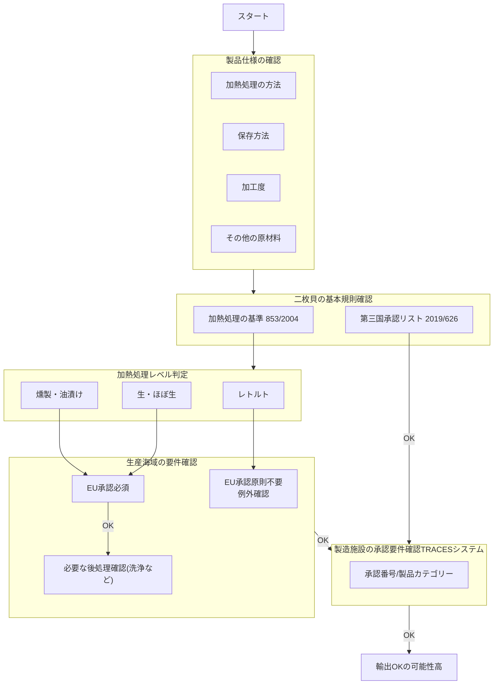

# 原材料の判定の難しさ

* EUR-Lexでキーワード検索すると検索結果が多すぎる。
  * beef→22352件
* 順序立てて、該当するRegulationを見ていく必要がある。
  * Regulation指定での検索が必要。
  * 牡蠣の場合、まずカテゴリー = 二枚貝の規則を確認するのが良さそう。
    * 動物原料食品の衛星に関する規則
    Regulation 853/2004 ANNEX III > SECTION VII（二枚貝軟体動物）
    * 牡蠣の場合上記を見ることはどうやって判断する？ →生物学的分類。ググる。
* 独特な分類もあるので、原材料・カテゴリー・Regulationはマッピングしておいた方がよさそう。
* マッピングと判断フローチャートはある程度作り込みが必要そう。。
  * ヒアリングしないとわからない。勉強会の情報だけでは難しそう。

## 牡蠣についての判断フロー
[かき燻製油漬け](https://www.kokubu.co.jp/brand/100/0317811.html)は輸出可能か？
原材料の牡蠣(二枚貝)についての判断フローを以下に示す。
Claudeが教えてくれたんですが、これで正しいのか検証はできていません。

